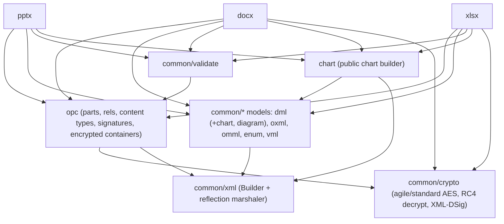
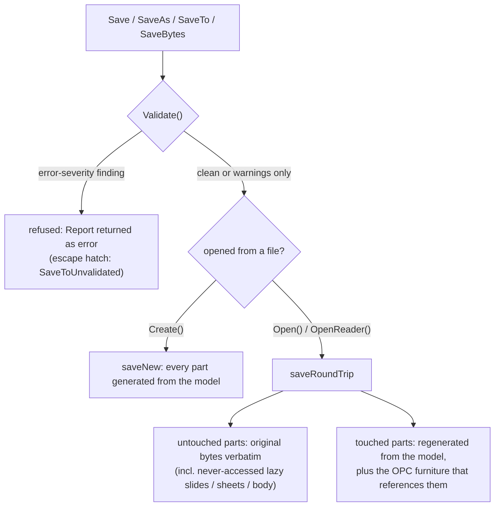

# Architecture

How spine is put together, drawn rather than narrated. For the round-trip
contract that underlies all of it, see
[CONTRIBUTING § Round-trip philosophy](../CONTRIBUTING.md#round-trip-philosophy).

## Package layering

- **opc** is the OPC container: parts, relationships, `[Content_Types].xml`,
  package signatures, and the CFB-wrapped encrypted containers. It depends only
  on `common/crypto` and `common/xml`.
- **common/xml** is the write substrate — the `Builder` and the reflection
  marshaler that every XML part is serialized through. It has no spine
  dependencies (Go stdlib only), which is why it sits at the bottom.
- **The shared models** (`common/dml` and its `chart`/`diagram` children,
  `oxml`, `omml`, plus the leaf packages `enum` and `vml`) are the typed OOXML
  structs. The ones that marshal (dml, oxml, omml, dml/chart, dml/diagram)
  depend on `common/xml`; `enum` and `vml` are pure leaves.
- **common/validate** is the pre-save checker. It depends on `opc` (it inspects
  the assembled package), so it is not a bottom-level leaf.
- **chart** is the public chart builder; it composes `common/dml`(/chart) values
  and writes them through `common/xml`.
- **pptx / docx / xlsx** are the format packages. Each imports `opc`, the
  models, `validate`, and `chart`; `docx` and `xlsx` additionally import
  `common/crypto` directly for their `OpenEncrypted` wrappers (pptx reaches
  encryption through `opc`). Each also has an `internal/oxml` package for its
  format-specific structs.

## Save pipeline

`SaveTo` runs `Validate()` first and returns the `Report` as an error on any
error-severity finding, so a structurally corrupt package is never written;
`SaveToUnvalidated` is the escape hatch. (`xlsx` also refuses an empty workbook
with `ErrNoSheets` ahead of the gate.) The origin decides the rest: a document
built with `Create` regenerates every part (`saveNew`), while one opened from a
file takes `saveRoundTrip`, writing untouched parts verbatim and regenerating
only the ones the session touched.

## Lazy-parse part lifecycle

```mermaid
stateDiagram-v2
    [*] --> Raw: Open() validates the part, then discards the model
    Raw --> Parsed: first read (Slide shapes / Sheet cells / Document body)
    Parsed --> Dirty: any mutation
    Raw --> [*]: Save writes original bytes verbatim
    Parsed --> [*]: Save re-emits the part (xlsx: original bytes; pptx/docx: re-marshal, near-always byte-identical)
    Dirty --> [*]: Save regenerates the part from the model
```

Slides (`pptx`), sheets (`xlsx`), and the document body (`docx`) are validated
once at `Open` and then discarded; the model is re-parsed only on first access.
Reading never marks a part dirty, but what "unedited" buys you differs by format,
in three tiers:

1. A part **never accessed at all** keeps its model nil and passes through
   verbatim — guaranteed byte-identical.
2. `xlsx` re-emits a clean parsed sheet's **original bytes** (it regenerates only
   when the sheet is `dirty`), so an accessed-but-unedited sheet is byte-identical
   too.
3. `pptx` and `docx` **re-marshal** an accessed slide/body from its model rather
   than replaying its bytes. This reproduces the original for the overwhelming
   majority of files, but it can drift from a whitespace-preserving producer's
   exact bytes — so merely *reading* a slide or the body can cost byte-identity on
   a small fraction (~1%) of wild files. That is why `pptx` keeps a
   never-materialized slide on the verbatim path instead (corpus: all 1200 decks
   round-trip byte-identical via pass-through, versus 1189 when every slide is
   regenerated; docx 1196 versus 1194).

One nuance: `pptx`'s `ReplaceText` materializes each scanned slide's model (its
docx/xlsx text-scan counterparts do not), so those slides move to *Parsed* and
are regenerated on save — byte-identical where no key matched, but no longer on
the never-accessed verbatim-bytes path.

## Round-trip fidelity model

The invariant behind every diagram above is **byte-identity for unmodified
content**: opening and saving reproduces every part byte-for-byte — verbatim for
a part the session never materializes, and subject to the tier-3 re-marshal
caveat above for an accessed-but-unedited `pptx`/`docx` part — and mutating one
part never disturbs another's bytes. A second invariant follows —
**childOrder**: parsed parts record the order of their children (including
unknown, raw-captured elements) so they re-serialize in the original sequence,
and every mutator that appends to a typed slice must maintain that bookkeeping.
Markup the typed model does not represent is captured verbatim and replayed on
save, so unknown content survives a round trip untouched. Both invariants and
the tests that enforce them are described in
[CONTRIBUTING § Round-trip philosophy](../CONTRIBUTING.md#round-trip-philosophy).
