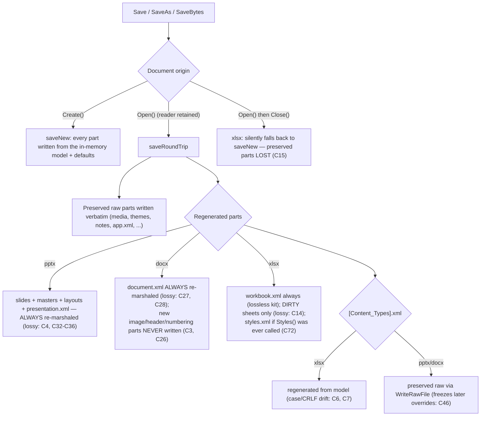
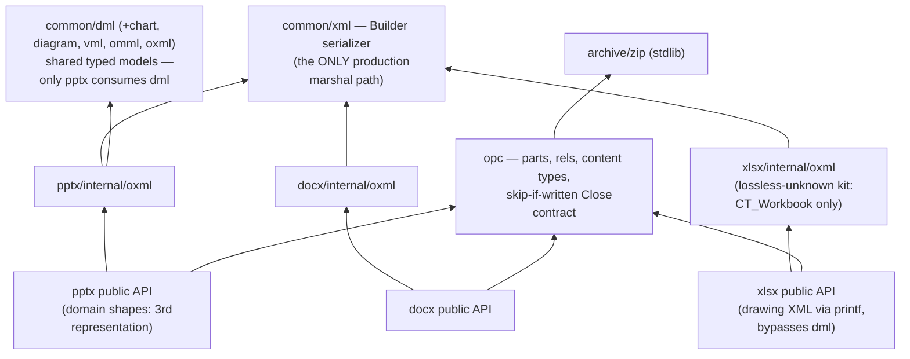

# Spine Documentation Audit — 2026-07-07

Audit of every reader-facing surface in `github.com/mgilbir/spine`: README.md (337 lines), SVG_PPTX_EMBEDDING_PLAN.md (369), spec/README.md (142), the three `examples/` program headers, godoc package/function comments across all public packages, Makefile targets, and `testdata/fetch.sh`. There is no docs/ tree (beyond audit reports), no CONTRIBUTING, no CHANGELOG, no ADRs, and **zero diagrams anywhere in the repository**. Accuracy claims were verified against the code and by running examples; several verdicts reuse runtime reproductions from the companion code audit (`docs/audits/codebase-audit-2026-07-07.md`, findings cited as `C#`).

**Headline:** the docs' single biggest problem is not what they say but what they *omit* — the library behaves radically differently on `Create()`-built vs `Open()`ed documents (mutations silently dropped or corrupting on the latter), and no sentence anywhere warns the reader. Where the docs do speak, the README's marquee claims are the least true ones: byte-identical round-trip "across all formats" (two fixtures fail today), gradient fills (silently dropped — the shipped example's own output contains zero gradients), placeholders/themes (stub APIs returning nil), and an open-modify walkthrough that produces a file PowerPoint wants to repair. The Units section teaches the wrong unit for font sizes. Structurally, the README is the only user-facing document and is in decent inverted-pyramid shape; the gap is architecture (never drawn), contributor onboarding (scattered), and an orphaned planning doc at the repo root describing a feature that shipped months ago.

Severity counts: **11 high, 14 medium, 5 low** (30 findings, D1–D30).

---

## 1. Summary table

| ID | Sev | Document | Issue | Status |
|----|-----|----------|-------|--------|
| D1 | high | README.md:8 | "Byte-identical round-trip fidelity for unmodified parts across all formats" — false; two xlsx fixtures fail byte-identity today (C6/C7) | CONFIRMED |
| D2 | high | README.md:14; examples/create_presentation/main.go:4 | "gradient fills" promised twice; gradients are silently dropped at save — the example's own output contains 0 `gradFill` | CONFIRMED |
| D3 | high | README.md:192-220 | "Opening and Modifying a Presentation" walkthrough produces a repair-prompt file (added slide has no layout relationship, C18) | CONFIRMED |
| D4 | high | README.md:16 | "Support for placeholders and themes" — `Theme()` always nil; master/layout `Placeholders()` are stubs (C84) | CONFIRMED |
| D5 | high | xlsx/errors.go:1-2 | Package doc: "currently a placeholder and will be fully implemented in a future release" — first thing every pkg.go.dev visitor reads about a fully-featured package | CONFIRMED |
| D6 | high | pptx/template.go:10-17 | `ReplaceText` doc promises XML+shape updates unconditionally; reality: silent no-op on created decks (C19), destroys unsaved shape edits on opened decks (C5) | CONFIRMED |
| D7 | high | README.md:270-283 | Units section: `fontSize := dml.Points(12)` — `Points` returns EMU but `Run.SetFontSize(float64)` takes points; following the example yields a 152,400pt font | CONFIRMED |
| D8 | high | README.md:91 | `doc.AddHeading("Welcome", 1)` example renders as plain text — `Create()` writes no styles.xml so "Heading1" is undefined (C64) | CONFIRMED |
| D9 | high | (missing doc) | Nothing anywhere documents the Create-vs-Open behavioral split or what survives a save — the library's most dangerous semantics (C1–C5, C12–C15) are undocumented | CONFIRMED |
| D10 | high | SVG_PPTX_EMBEDDING_PLAN.md | 369-line root-level plan reads as an open TODO ("What is missing is the write path…") for a feature fully shipped in the same commit; meanwhile README never mentions SVG support at all | CONFIRMED |
| D11 | high | xlsx/workbook.go:311; pptx/slide.go:84; Save methods | Lifecycle godoc hides hazards: `Close` "releases resources" (a later `Save` silently writes a gutted file, C15); `AddPicture` "adds a picture shape" (it's a stub with nil error, C79); every `Save` is a one-liner with no regeneration/preservation semantics | CONFIRMED |
| D12 | med | README.md:11,31-32 | Feature claims true only on the Create path: "Add, remove, and reorder slides" (Remove+Add fails Save on opened decks, C16), "named ranges" (dropped on opened workbooks, C12), "data validation" (ShowDropDown inverted/no-op, C76) | CONFIRMED |
| D13 | med | README.md | Coverage gaps: xlsx image embedding (shipped #6) absent from features; `CreateWidescreen`, `SaveAs`, cross-format `SaveBytes`, pptx/docx `OpenReader`, SVG APIs, and the entire `examples/` directory unmentioned | CONFIRMED |
| D14 | med | README.md:147-169 | In-memory writing taught via xlsx-only `WriteToBuffer` (redundant with `SaveBytes`, which exists in all three formats) — steers readers to the least portable API | CONFIRMED |
| D15 | med | common/xml (package doc) | "Package xml provides XML namespace constants" — it is the serialization engine for the whole library (Builder + reflection marshaler) | CONFIRMED |
| D16 | med | spec/README.md:119 | Documents `gen_spec/ # Shape type generator` — directory is untracked; a fresh clone can't find it (C113) | CONFIRMED |
| D17 | med | multiple godoc comments | Doc-comment drift set: `GraphicData` claims unknown content is preserved (never marshaled, C100); `ExtendedProperties` documents settable fields that marshal hardcodes to 0/false (C55); `NumberFormatDate = 14 // "m/d/yyyy"` vs builtin "mm-dd-yy" (C131); "Write content types (must be last)" inverts OPC guidance (C123); `pointsToTwipsSigned` claims a nonexistent difference (C124); dml constructor comments name the wrong functions (C146); field `Conformance` stores `mc:Ignorable` (C58) | CONFIRMED |
| D18 | med | (missing doc) | README §Contributing invites PRs but there is no CONTRIBUTING: fixture story (external.txt, unfetchable files, python-tests), lint version, and test-skip behavior are undocumented or scattered across README/Makefile/fetch.sh | CONFIRMED |
| D19 | med | README.md:329 vs go.mod:3 | "Go 1.25 or later" vs `go 1.25.5` patch pin — contributors on 1.25.0–1.25.4 with GOTOOLCHAIN=local get a hard error the docs say shouldn't happen | CONFIRMED |
| D20 | med | (missing doc) | No architecture documentation and zero diagrams in the repo — the 5-layer design, the three-representation model, and the save pipeline exist only in code and in scattered comments | CONFIRMED |
| D21 | med | (missing doc/index) | Findability: no docs index; `docs/` contains only audit reports; SVG plan is an orphan at root; a reader with a question has exactly one place to look (README) and no map beyond it | CONFIRMED |
| D22 | med | (missing doc) | Concurrency contract undocumented anywhere — concurrent Save+mutate races are real (C53/C142) and no doc says "single-goroutine only" | CONFIRMED |
| D23 | med | errors.go files; godoc | Error surface undocumented: no doc says which errors `Open`/`Save` return; xlsx documents `ErrNotImplemented`/`ErrInvalidRange` that are never returned (C116) | CONFIRMED |
| D24 | med | opc godoc | opc is a documented public package but its load-bearing contracts are undocumented: skip-if-written behavior of `Close`, `WriteRawFile` freezing content-type regeneration (C46), `Close` mutating exported fields (C53), returned part writers invalidated by the next call | CONFIRMED |
| D25 | med | pptx/options.go, media.go godoc | Dead API documented as if real: `ExportFormat*`/`ExportOptions`/`OpenOptions`/`SaveOptions` and the Video/Audio/OLEObject surface render on pkg.go.dev with no consuming implementation (C83/C141) — godoc *is* the advertisement | CONFIRMED |
| D26 | low | pptx docs | Terminology drift: "template" means both a base file (`CreateFromTemplate`) and replacement placeholders (`ReplaceText` docs); opc has both `File` (real) and `Part` (dead) for the same concept | CONFIRMED |
| D27 | low | README.md:285-301 | Slide-layout table duplicates code constants — accurate today (all 11 verified), but a second source of truth with no note pointing at `pptx/layout.go` | CONFIRMED |
| D28 | low | examples/* | Example outputs are never asserted against their headers' claims — which is exactly how D2 shipped; headers otherwise accurate (docx/xlsx examples verified) | CONFIRMED |
| D29 | low | (missing doc) | python-pptx-derived material (`python-tests/`, `spec/gen_spec/`) carries no attribution or provenance note anywhere (MIT requires notice if committed) | CONFIRMED |
| D30 | low | README.md:258 | Package Structure lists `docprops/` as "Document properties (core and extended)" — the package is dead and namespace-wrong (C109); the working implementation is in `opc` | CONFIRMED |

---

## 2. Doc map — current vs proposed

### Current

| Surface | Lines | Purpose (actual) | Audience | Found how |
|---|---|---|---|---|
| README.md | 337 | Everything: pitch, features, install, 6 quick starts, package map, units, layouts, testing, requirements | users + contributors, mixed | repo root |
| SVG_PPTX_EMBEDDING_PLAN.md | 369 | Implementation plan for a shipped feature (stale) | past-implementer (nobody now) | repo root, orphan |
| spec/README.md | 142 | How to obtain ISO/MS spec files + run extraction | maintainer | only if browsing spec/ |
| examples/*/main.go headers | ~7 ea | Feature-tour programs with run instructions | users | only if browsing; README never links |
| godoc (pptx 375, docx 118, xlsx 83 exported symbols) | — | API reference; 100% comment coverage, several comments wrong (D5, D6, D11, D17) | users | pkg.go.dev |
| Makefile / fetch.sh / .golangci.yml | — | fetch/test/lint entry points, undocumented behaviors | contributors | discovery |
| docs/audits/*.md | — | audit reports (this and the code audit) | maintainer | docs/ |

### Proposed

```
README.md                      # pitch, install, ONE quick start per format, links out; audience: evaluating/new user
docs/README.md                 # index: one line per doc, routed by reader question
docs/architecture.md           # layering + save pipeline + diagrams (see §5); audience: contributor, agent
docs/saving-and-round-trip.md  # THE missing doc (D9): Create vs Open, what is preserved vs regenerated,
                               # per-format tables, current limitations; audience: any user mutating opened files
docs/howto-images.md           # raster + SVG embedding across pptx/docx/xlsx (D13, D10's salvageable content)
docs/in-memory.md              # OpenReader/SaveBytes for all three formats (replaces D14's xlsx-only section)
CONTRIBUTING.md                # build/test/lint, fixture story (external.txt, skips, python-tests), lint pinning (D18)
docs/archive/svg-plan.md       # SVG plan moved+marked historical, or deleted outright (D10)
spec/README.md                 # keep as-is minus the gen_spec line until tracked (D16)
godoc                          # fix lying comments (D5, D6, D11, D17); add Example funcs (none exist today)
```

Splits: README's Testing section → CONTRIBUTING.md; README's in-memory xlsx examples → docs/in-memory.md (all formats). Merges: none needed — the problem is missing docs, not fragments. Deletions: SVG plan from root; `docs/audits/` stays as-is (internal).

---

## 3. Drift verification

Each accuracy claim, the exact check, and the result. (Checks marked `C#` were executed during the code audit in this session; commands shown were run against the working tree at HEAD `3df6088`.)

| Finding | Check run | Result |
|---|---|---|
| D1 round-trip claim | `go test ./... -count=1` | `FAIL: TestRoundTripByteIdentical/fred_data` (CRLF vs LF, hexdump-verified `0a` → `0d0a`), `/abs_australia` (`Extension="JPG"` → `jpg`) |
| D2 gradient fills | `go run ./examples/create_presentation` then `unzip -p output.pptx ppt/slides/slide1.xml \| grep -c gradFill` | `0` occurrences (6 `solidFill`); example sets `NewGradientFill` at main.go:43 |
| D3 open-modify walkthrough | Code-audit repro (C18): Open → AddSlide → SaveAs; inspect zip | new slide part has no `_rels/slideN.xml.rels`; spec requires a layout rel per slide |
| D4 placeholders/themes | grep + trace: `p.theme` never assigned; `master.go:64-94`, `layout.go:65-79` return nil literals | stubs confirmed (C84) |
| D5 xlsx package doc | `go doc ./xlsx \| head -3` | "This package is currently a placeholder…" |
| D6 ReplaceText doc | Runtime repros: Create→SetText→ReplaceText (unchanged); Open→AddTextBox→ReplaceText (new box wiped) | both confirmed (C19, C5) |
| D7 units example | `go doc pptx.Run.SetFontSize` → `SetFontSize(size float64)` "sets the font size in points"; `dml.Points(12)` → `EMU` (152400) | unit mismatch confirmed |
| D8 AddHeading | `saveNew` writes styles.xml only `if d.styles != nil`; `Create()` never sets it (docx/document.go:397-407) | "Heading1" undefined in output (C64) |
| D10 SVG plan staleness | `git show --stat 4ebf569` (plan + implementation + tests in one commit); all "Expected Public API" symbols exist (`Picture.SetSVGData` etc.) | plan complete, doc reads as TODO |
| D11 Close/AddPicture docs | Read comments at xlsx/workbook.go:311, pptx/slide.go:84-93; runtime repro of Close→Save (C15) and AddPicture (C79) | comments hide confirmed hazards |
| D12 feature claims | Runtime repros: RemoveSlide+AddSlide → `opc: duplicate part` save failure (C16); Open→AddDefinedName→Save → no `definedNames` in output (C12); ShowDropDown mapping read (C76) | all confirmed on the Open path |
| D13 xlsx images missing from README | `git log --oneline -1` = "xlsx: support embedding images (#6)"; README features list (lines 26-33) has no image entry | confirmed |
| D15 common/xml doc | `go doc ./common/xml \| head -3` vs builder.go (641 lines) + marshal.go (377) | understatement confirmed |
| D16 gen_spec | `git status` → `?? spec/gen_spec/`; spec/README.md:119 references it | confirmed |
| D19 go version | go.mod: `go 1.25.5`; README:329 "Go 1.25 or later" | mismatch confirmed |
| D27 layout table | grep all 11 constants in pptx/layout.go:12-22 | all exist — table accurate today |
| README examples compile/run | All 8 snippets extracted to scratch modules and `go build`/`go run` (code-audit DX pass) | all compile and run — the drift is in *outcomes* (D2, D3, D8), not syntax |
| spec/README extraction scripts | `ls spec/extract_examples.py spec/extract_msoi.py spec/testdata spec/spectest` | all exist; spectest runs green from committed testdata |

---

## 4. Findings by category

### 4.1 Drift / inaccuracy

**D1 — README.md:8.** The reader task broken: choosing this library *because* of fidelity. The headline feature bullet is contradicted by the repo's own test suite on real-world files. Direction: soften to "byte-identical round-trip for unmodified parts (verified against a corpus; see limitations)" until C6/C7 are fixed, then re-strengthen.

**D2 — README.md:14 + example header.** A user builds a deck with gradient fills, opens it in PowerPoint, sees unfilled shapes, and has no error to search for. The example has demonstrated this bug to every reader since it shipped, because nothing ever asserted the output (D28). Direction: fix C21 or delete the claim; either way add an output assertion to the example (or a test that greps the produced file).

**D3 — README.md:192-220.** The walkthrough positioned as the canonical "modify an existing deck" path emits a file PowerPoint offers to repair. An agent following the README as spec corrupts user files. Direction: fix C18; until then the walkthrough must carry a limitation note.

**D4 — README.md:16.** "Placeholders and themes" names two APIs that return nil unconditionally. Direction: drop "themes" from the feature list (or scope it: "theme parts are preserved on round-trip"); placeholders work only in the slide context — say which.

**D6 — pptx/template.go:10-17.** The doc comment is the only spec for ReplaceText, and it describes neither of the two real behaviors. Direction: document the Open-path-only contract *and* the re-materialization side effect; better, fix C19/C5 and document the unified behavior.

**D7 — README.md:270-283.** The Units section's third example binds `dml.Points` to the one quantity in the library that does **not** take EMU. A reader wiring `SetFontSize(dml.Points(12))` gets a comically broken deck with no error. Direction: replace the `fontSize` line with a position/size example; add one sentence: "font sizes are plain points (`SetFontSize(12)`); EMU helpers are for geometry."

**D8 — README.md:91.** The docx Quick Start's heading renders as body text in Word. Direction: fix C64 (ship minimal default styles); until then the example misleads.

**D11 — lifecycle godoc.** Three comments that actively hide confirmed hazards (Close→Save gutting, AddPicture stub, Save one-liners). Direction: document `Close` as terminal ("Save after Close is invalid"), mark `AddPicture` deprecated/stub pointing at `Picture.SetImage`, and give each `Save` a paragraph on what gets regenerated vs preserved (or link docs/saving-and-round-trip.md).

**D12 — README.md:11,31-32.** Feature bullets that are true on Create and false/corrupting on Open (slides add/remove C16, named ranges C12, data-validation dropdown C76). Direction: same as D9 — the split must be documented; feature list should not claim Open-path parity it doesn't have.

**D17 — the godoc drift set.** Seven comments that state the opposite of the code (table row lists all, with code-audit IDs). Each is a one-line fix; collectively they mean a reader cannot trust comments as spec. Direction: fix all seven; adopt "comments state contracts, not aspirations" in review.

**D5, D10, D15, D16, D19, D30** — see summary table; each is a single-surface correction (package doc rewrite, plan archival, version alignment, package-map correction).

### 4.2 Inverted pyramid

The README itself is in good shape: pitch → features → install → runnable examples in the first 75 lines. Two violations:

**D10 (structure aspect) — SVG_PPTX_EMBEDDING_PLAN.md.** A repo-root doc whose first useful fact for a 2026 reader ("this is done; here's the API") appears nowhere in it — the "Current State" section (line 12) describes February's code. A plan is write-once; as a *reader* doc it inverts the pyramid by definition. Direction: archive/delete; move the "Expected Public API" section's content into README/howto-images.md as present-tense documentation.

**D24 — opc package doc.** Opens with what OPC is (spec recital) rather than the two things a consumer must know first: the Reader/Writer lifecycle and the skip-if-written contract that all of pptx/docx/xlsx depend on. Direction: lead the package doc with the contract; spec citation last.

### 4.3 Sizing / decomposition

No oversized docs — the problem is the inverse: **one README carrying six documents' jobs** (marketing, tutorial ×3, reference, contributor guide). The proposed tree in §2 is the split. The only true split candidate inside README is Testing → CONTRIBUTING.md (D18); the only merge candidate is the SVG plan's API content → howto-images.md (D10).

### 4.4 Architecture as drawn process

**D20.** Zero diagrams in the repository. Three processes are currently explained nowhere (or only in code comments) that prose demonstrably fails to carry — the code audit found five critical bugs precisely at the seams these diagrams would draw. See §5 for the backlog with drafted Mermaid.

### 4.5 Usefulness / audience fit

**D9 — the missing "saving semantics" doc is the audit's top finding.** Every reader class is hurt: the newcomer loses data and doesn't know why; the maintainer six months out cannot answer "does SetCellValue on an opened workbook preserve oleObjects?" without reading marshal code (answer: no, C14); the agent-as-reader silently corrupts files while doing exactly what the docs show. Direction: write `docs/saving-and-round-trip.md` with a per-format table — *operation × document origin (Created/Opened) → outcome (persisted / silently dropped / corrupts)* — even before the bugs are fixed. Honest limitation tables are cheap; silent data loss is not.

**D25 — dead API as documentation.** pkg.go.dev renders `ExportFormatPDF`, `SaveOptions.Password`, `Video.SetPosition` etc. as real capabilities. godoc is the advertisement; shipping unimplemented surface *is* a docs bug, not just a code smell. Direction: delete (pre-v1) or tag `// Not yet implemented; consumed by nothing.`

**D14, D13** — the README teaches the one non-portable in-memory API and omits the portable one, and omits shipped features (xlsx images, SVG, CreateWidescreen). Audience fit inverted: newest features are the least documented.

### 4.6 Single source of truth

- Version requirement: README:329 vs go.mod:3 (D19) — go.mod is canonical; README should say "see go.mod" or match it.
- Feature truth: README features vs godoc vs reality — three tellings, drifting (D2, D4, D12). Canonical home should be godoc + a generated/reviewed README list.
- Layout list: README table vs pptx/layout.go constants (D27) — accurate today; add "source: pptx/layout.go" note.
- Core-properties: two implementations, README's package map blesses the dead one (D30).
- Terminology: "template", opc "File"/"Part" (D26).

### 4.7 Coverage

Missing entirely (→ §6 backlog): saving/round-trip semantics (D9), architecture (D20), contributor guide (D18), concurrency contract (D22), error reference (D23), images how-to (D13), in-memory how-to for pptx/docx (D14), godoc `Example` functions (zero exist in the repo), troubleshooting ("PowerPoint wants to repair my file" — the code audit found four distinct causes a user could hit), provenance/attribution for python-pptx-derived material (D29).

### 4.8 Findability

**D21.** One entry point (README), no index, orphan plan at root, examples unlinked (a user wanting a full program has no pointer to `examples/`). The proposed `docs/README.md` index routes by question ("I want to modify an existing file" → saving-and-round-trip.md; "my file won't open in Office" → troubleshooting). Cross-links checked: no dead links exist today — because there are almost no links.

---

## 5. Diagram backlog

Value-ordered. Top three drafted; all target `docs/architecture.md` unless noted.

**1. Save pipeline per format (flowchart)** — would have made C2/C3/C14/C15 obvious on inspection; answers the #1 reader question ("what happens to my file when I Save?").



**2. pptx three-representation sync (sequence)** — draws the seam where C1 and C5 live; target: docs/architecture.md and the pptx package doc.

```mermaid
sequenceDiagram
    participant U as User code
    participant D as Domain shapes (slide.shapes)
    participant O as oxml model (slideXML)
    participant Raw as Preserved bytes

    U->>O: Open() parses slide XML
    O->>D: materializeShapes() (read-only view)
    U->>D: AddTextBox() / SetName()  (sets shapesModified)
    U->>O: ReplaceText() mutates XML directly
    O-->>D: re-materialize — UNSAVED domain edits WIPED (C5)
    U->>D: Save()
    D->>O: syncShapesToXML(): CLEARS spTree, rebuilds from domain —
    Note over D,O: groups/charts/unmodeled props DELETED (C1)
    O->>Raw: marshal + write; untouched parts from Raw
```

**3. Package layering (flowchart, C4-container flavor)** — target: docs/architecture.md, replacing the README's flat package list as the structural view.



**4. Document lifecycle (stateDiagram)** — states: Created / Opened / Mutated / Saved / Closed, with the invalid-but-silent transitions (Close→Save, Save→mutate→Save) marked. Target: docs/saving-and-round-trip.md.

**5. OPC package anatomy (flowchart)** — parts, `_rels/`, `[Content_Types].xml`, relationship resolution; target: opc package doc. Lower value (spec-adjacent, stable).

---

## 6. Missing-docs backlog

By unblocking value:

1. **docs/saving-and-round-trip.md** (D9) — the per-format *operation × origin → outcome* truth table, including current limitations. Unblocks: every user of Open(); converts five classes of silent data loss into informed decisions. Cheapest high-value doc in the backlog.
2. **CONTRIBUTING.md** (D18) — build/test/lint, pinned golangci-lint, fixture lifecycle (`make fetch`, external.txt, what skips when files are missing, the python-tests dependency), how to add a fixture. Unblocks: any outside contribution; makes the red/green test split (C8) legible.
3. **docs/architecture.md** (D20) — diagrams 1–3 above + a paragraph per layer + the "three representations" explanation. Unblocks: contributors and agents; would have exposed the C1/C5 seam by inspection.
4. **README surgery** (D1-D4, D7, D8, D12-D14) — one honest pass: fix the four false claims, the units example, add xlsx images + SVG + SaveBytes + examples/ link. Half a day; removes every high-severity *misleading* surface.
5. **godoc Example functions** — zero exist. One `Example_openAndModify` per package doubling as a compile-checked tutorial (and a regression net for D3/D8-class breakage).
6. **docs/howto-images.md** (D13/D10) — raster + SVG across the three formats; salvages the SVG plan's API content.
7. **Troubleshooting** — "Office wants to repair my file" (dangling rels C3/C17/C18, missing layout rel), "my edits disappeared" (→ doc 1), "tests skip on my machine" (fixtures).
8. **Error + concurrency reference** (D22/D23) — one section per package: returned sentinel errors, and a single sentence establishing the single-goroutine contract.
9. **Provenance note** (D29) — attribution for python-pptx-derived material, before any of it is committed.

---

## 7. Open questions (maintainer-only)

1. **Is the Open-path mutation API intended to work?** D9's doc can be written two ways: as a limitations table ("not supported yet") or as a bug list ("supported, currently broken"). Same code, different docs. The code audit's open question #1 is the same fork.
2. **Who is the opc package for?** If it's public API for third parties, D24's contract documentation is required; if internal-only, consider `internal/` and the docs burden drops.
3. **Is README the marketing surface or the manual?** The proposed split assumes both audiences matter; if this is a personal library, docs/saving-and-round-trip.md + CONTRIBUTING may be the only two worth writing.
4. **SVG plan: archive or delete?** Content worth salvaging is only §"Expected Public API" (→ howto-images.md); the rest is history git already keeps.
5. **Version claim:** is the `go 1.25.5` pin deliberate (then README should say so) or accidental (then relax to `go 1.25`)?
