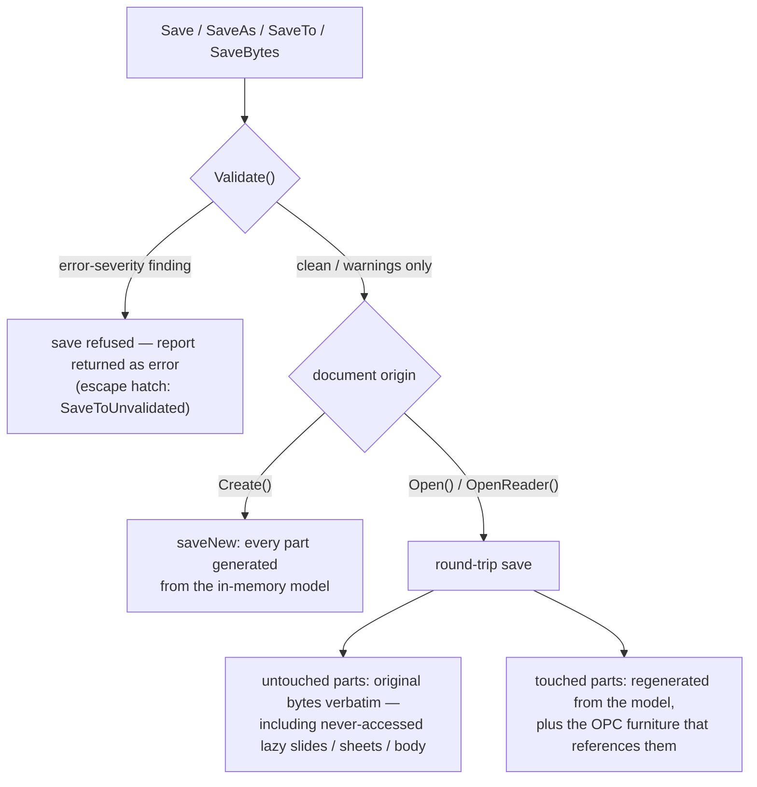
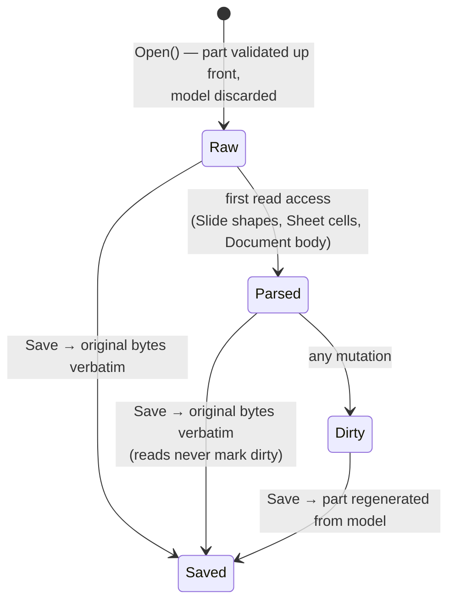
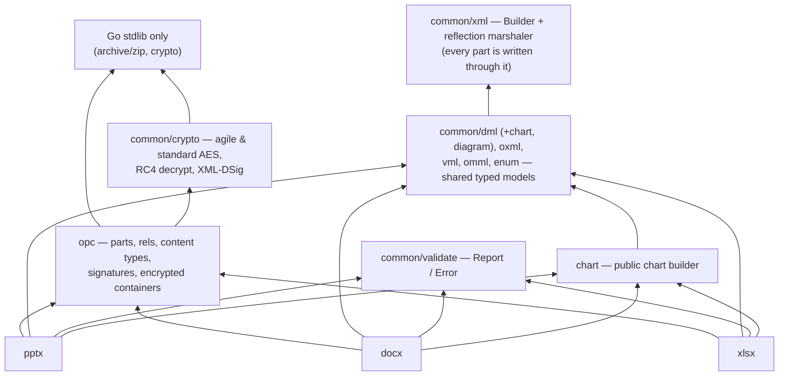
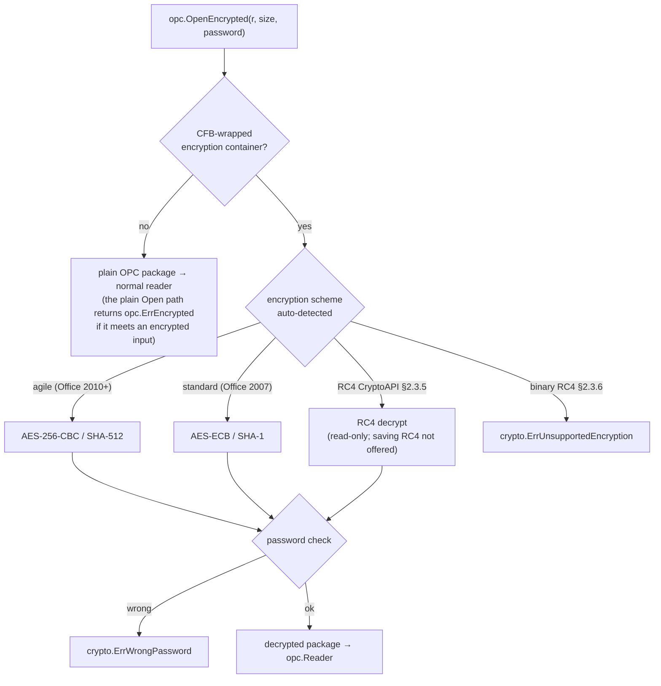

# Spine Documentation Audit — 2026-07-26

Audit of every reader-facing surface at HEAD `9629fbf` (post-0.1.0): README.md (984 lines), CHANGELOG.md (1424), CONTRIBUTING.md (81), spec/README.md (152), testdata/README.md (22), testdata/cc/README.md (386), docs/audits/ (4 files), the 10 `examples/` programs, godoc package/method comments across all public packages, and the Makefile. Follows up the 2026-07-07 docs audit (D1–D30); IDs here continue the series at **D31**. Every accuracy claim was checked against the code: all 19 README Go snippets were extracted, compiled against the local module, and executed; all 10 examples were run; ~265 backticked API symbols in the Features section were resolved to declarations; the testing/corpus documentation was verified claim-by-claim down to manifest row counts.

**Headline:** the docs now tell the truth where they speak — a dramatic reversal from 2026-07-07. All 19 README snippets compile, run, and produce the claimed outcomes; all 10 examples run clean; 264 of 265 feature-list symbols exist as documented; the entire testing/corpus/fuzzing doc surface is accurate to the flag level. The remaining problems are (1) **godoc drift on two marquee packages** — `common/crypto`'s package doc describes only the legacy obfuscation helpers while the package is the AES/RC4/XML-DSig engine, and one file comment claims RC4 is *rejected* when decryption shipped; `chart`'s package doc still calls its shipped format integrations future "Phase B" work — (2) **coverage gaps**: whole shipped capabilities (video/audio embedding, `Slide.Duplicate`, in-memory encrypted I/O) appear nowhere in the README, and the Features list omits capabilities the same README demonstrates 100 lines later; (3) **structure**: a 984-line README carrying six documents' jobs, a Features section whose bullets run to 198 words, and — for the third audit running — **zero diagrams** in any reader-facing doc.

Severity counts: **1 high, 11 medium, 7 low** (19 findings, D31–D49).

---

## 1. Summary table

| ID | Sev | Document | Issue | Status |
|----|-----|----------|-------|--------|
| D31 | high | common/crypto/legacy.go (pkg doc); agile.go:12-15 | Package doc describes only "deliberately weak… guard nothing" legacy obfuscation while the package implements agile/standard AES, RC4 decrypt, and XML-DSig; agile.go's file comment says RC4 CryptoAPI (§2.3.5) is "rejected with ErrUnsupportedEncryption" though decryption shipped | CONFIRMED |
| D32 | med | chart/chart.go:11-16, chart/parse.go:15; README.md:438 | Shipped chart integrations still labeled future: godoc says wiring AddChart/Charts() "is Phase B"; README heading says "Charts (preview)" with no stated meaning | CONFIRMED |
| D33 | med | README.md:44-75, 20-43 (Features) | Features list omits capabilities the same README demonstrates in Quick Start: docx comments, bookmarks, footnotes/endnotes, hyperlinks; pptx comments | CONFIRMED |
| D34 | med | README.md (whole) | Shipped public API absent from README entirely: `Slide.AddVideo`/`AddAudio`, `Slide.Duplicate`, `docx.OpenEncryptedReader`/`SaveEncryptedTo`, `opc.ErrStrictOOXML`, `opc.MaxDecompressed*` zip-bomb knobs, `Slide.ReplaceTextInShape` | CONFIRMED |
| D35 | med | README.md:108-123 | Examples surface drift: `pptx_deck` (the richest pptx example) missing from the list; lead-in paragraph duplicated verbatim at lines 108 and 113 with two competing descriptions of `xlsx_report` | CONFIRMED |
| D36 | med | README.md:966; CONTRIBUTING.md:26-35; Makefile:64 | Fuzz docs describe 8 targets as the fuzz surface and Makefile comment says "every fuzz target"; the repo has 23 targets, `make fuzz` runs 8 | CONFIRMED |
| D37 | med | pptx/presentation.go:732,1913; docx/document.go:598,616,644; xlsx/workbook.go:435,505 | Lifecycle godoc still one-liners: Save/Close say nothing about preserved-vs-regenerated; docx `SaveTo` omits the validation gate that pptx/xlsx document; Open comments never name their error sentinels | CONFIRMED |
| D38 | med | README.md:5-106 (Features) | Inverted-pyramid violation: 7 feature bullets exceed 80 words (max 198); a capability scan requires reading paragraphs | CONFIRMED |
| D39 | med | README.md (984 lines) | One file carries six documents' jobs (pitch, per-format tutorials ×3, chart guide, reference, testing); split proposal in §2 | CONFIRMED |
| D40 | med | (missing doc) | Zero diagrams in reader-facing docs, third audit running; architecture (save pipeline, lazy-parse lifecycle, layering) exists only in CHANGELOG prose and code | CONFIRMED |
| D41 | med | README.md:890-905 (Package Structure) | Package map omits `common/crypto` and `common/validate` though README references both packages' identifiers; `crypto.ErrWrongPassword`'s import path appears nowhere in the README | CONFIRMED |
| D42 | med | (missing index) | Findability: no docs index; CHANGELOG never linked from README; spec/README unlinked from any entry doc (orphan) | CONFIRMED |
| D43 | low | testdata/cc/README.md | Audience mix: contributor "fetch + test" quickstart interleaved with 250 lines of maintainer harvest ops (multi-crawl sweep, stress set, systemd batching); split | CONFIRMED |
| D44 | low | README.md:18,491 | "Series carry … value data labels (`SetDataLabels`)" implies per-series control; data labels are chart-wide (`Chart.SetDataLabels`, chart/chart.go:392) | CONFIRMED |
| D45 | low | pptx/template.go:12-19 | pptx `ReplaceText` godoc omits cross-run matching and scope (tables/groups yes, notes no) that the docx/xlsx counterparts document | CONFIRMED |
| D46 | low | all packages | Zero godoc `Example` functions repo-wide; pkg.go.dev shows no runnable examples | CONFIRMED |
| D47 | low | README.md | Concurrency contract stated in every format package doc but nowhere in README | CONFIRMED |
| D48 | low | README.md:954; testdata/README.md:10 | Fixture marker quoted as `# URL unknown`; the literal in external.txt is `— URL unknown` (em dash) on commented lines | CONFIRMED |
| D49 | low | README.md:926-942 | Slide-layout table duplicates pptx/layout.go constants — accurate today (all 11 verified), still no pointer to the source of truth | CONFIRMED |

### Prior findings (D1–D30) — status at 2026-07-26

Re-verified this audit, runtime where marked:

- **Fixed, runtime-verified**: D3 (open-modify walkthrough now produces a valid deck that reopens — snippet s14), D7 (Units section now states the font-size exception, README:924; `dml.Points(2)`=25400 EMU verified), D8 (create path writes styles.xml; heading styles defined — create_document output inspected), D14 (SaveBytes taught for all formats, `WriteToBuffer` correctly described as a wrapper — snippet s13), D27→D49 (layout table still accurate).
- **Fixed, inspected**: D5 (xlsx package doc real), D10 (SVG plan deleted), D15 (common/xml doc accurate), D16 (gen_spec documented as optional/gitignored), D18 (CONTRIBUTING.md exists and is accurate), D19 (go.mod `go 1.25` matches README), D21-partial (docs/audits indexed by its own README), D22 (concurrency contract now in all format package docs — see D47 for the README residue), D25 (dead export/media API removed; Video/Audio now *implemented* — see D34 for the inverse problem), D26/D30 (docprops package and `opc.Part` gone), D29 (python-pptx attribution present in testdata/README and spec/README).
- **Fixed per code history** (remediation waves #59–#88, not independently re-run here): D1, D2, D4, D6 (docx/xlsx; pptx residue → D45), D12, D13, D17, D23-partial, D24.
- **Addressed by new content**: D9 → "Opening vs. Creating Documents" (README:844) now documents the split and the three remaining asymmetries.
- **Still open**: D20 → **D40** (no architecture doc, no diagrams), D11-residue → **D37** (lifecycle godoc thin; the *behavior* hazards are fixed — Save-after-Close is safe now), D28 (examples now self-verify by reopening, but nothing asserts README-listed claims against example output automatically).

---

## 2. Doc map — current vs proposed

### Current

| Surface | Lines | Purpose (actual) | Audience | Found how |
|---|---|---|---|---|
| README.md | 984 | pitch + 102-line feature catalog + 15 quick starts + reference (validation/flavors/units/layouts) + testing | user + contributor, mixed | repo root |
| CHANGELOG.md | 1424 | 0.1.0 release narrative (Performance/Fixed/Changed/Added/Removed) | upgrader, maintainer | root; **unlinked from README** |
| CONTRIBUTING.md | 81 | build/test/lint/fuzz, round-trip philosophy, commit style, audit-ID convention | contributor | root; linked from README |
| docs/audits/ (4 files) | ~1100 | historical audit records, ID registry | maintainer, agents | docs/; indexed by own README |
| spec/README.md | 152 | obtain ISO/MS spec files, run extraction | maintainer | **orphan** — only by browsing |
| testdata/README.md | 22 | fixture fetch, python-pptx corpus | contributor | linked from README |
| testdata/cc/README.md | 386 | corpus pipeline **and** maintainer harvest ops | contributor + maintainer, mixed | linked from README |
| examples/*/main.go | 10 programs | runnable feature tours (self-verifying: most reopen their output) | user | linked from README (9 of 10) |
| godoc | — | API reference; concurrency contracts present; two package docs wrong (D31, D32) | user | pkg.go.dev |
| Makefile | 80 | annotated targets | contributor | discovery |

### Proposed

```
README.md (~250 lines)            # pitch, scannable feature summary (one line per capability,
                                  # linking down), install, ONE quick start per format, links out
docs/README.md                    # index routed by reader question ("modify an existing file?" /
                                  # "encrypted documents?" / "how do I contribute?")
docs/pptx.md, docs/docx.md,       # per-format guides: absorb each format's Quick Start sections
docs/xlsx.md                      #   and the format's giant Features sub-bullets as real prose
docs/charts.md                    # the four chart sections (README:438-643) + chart pkg intro
docs/encryption-and-signing.md    # bullets 8/12/17 content: schemes, common/crypto path, error
                                  #   sentinels, VBA trust caveat, signature verification
docs/architecture.md              # layering + save pipeline + lazy-parse lifecycle, drawn (§5)
testdata/cc/README.md             # contributor core: pipeline, fetch, test, quarantine (≈120 lines)
testdata/cc/HARVEST.md            # maintainer ops: multi-crawl sweep, stress set, systemd batching
CONTRIBUTING.md                   # as-is + corrected fuzz-target inventory (D36)
CHANGELOG.md                      # as-is, linked from README
```

Splits: README → per-format + charts + encryption docs (D39); testdata/cc/README → contributor/maintainer halves (D43). Merges: none — fragments aren't the problem. Deletions: none. The Validation, Flavors, Units, and Layouts sections are small and load-bearing; they can stay in README or move to docs/reference.md, either is fine — what must not survive is the current burial order (see D38/D39).

---

## 3. Drift verification

Every accuracy check run this audit and its result. Snippets were extracted into scratch modules with a `replace` directive and executed; input fixtures were generated via the library's own Create paths.

| Check | Method | Result |
|---|---|---|
| All 19 README Go snippets | extract → `go build` → `go run` → inspect output files/stdout | **all compile, run, and match claims**; every produced file is a valid zip; readbacks verified (comments resolved state, hyperlink anchors, chart titles/series, formula round-trip, validation report fields) |
| pptx open-modify walkthrough (old D3) | run s14: Open → mutate → SaveAs → reopen | title updated, slide count 1→2, valid package |
| `SetHyperlinkToSlide(2)` "jump to slide 3 (0-based)" | code trace pptx/hyperlink.go:108 + runtime anchor readback | anchor "3" — comment correct |
| `SaveToUnvalidated` / `SaveTo` names | grep declarations | exact on all three types (pptx/presentation.go:754,764; docx/document.go:617,627; xlsx/workbook.go:459,472) |
| `docx.Document.AddChart(c, w, h)` signature | docx/chart.go:44 | `(c *chart.Chart, widthEMU, heightEMU int64) error` — matches |
| Units helpers | runtime: Inches(10.5)/Centimeters(5)/Points(2) | 9601200 / 1800000 / 25400 EMU; SetFontSize takes points (docx half-points ×2 internally) — README correct incl. the exception note |
| ~265 Features-section symbols (lines 5-106) | grep every backticked identifier to a public declaration | **264 pass**, 1 semantic mismatch (`SetDataLabels` → D44); merge/VBA/OLE/ActiveX/ink/3D/SmartArt/transition/pivot/slicer/sparkline/scenario symbols all present on the documented receivers |
| `crypto.Err*` sentinels | common/crypto/agile.go:41,48 | exist; import path `common/crypto` stated nowhere in README (→ D41) |
| All 10 examples | `go run` each; validate outputs; diff behavior vs README list | all exit 0, outputs valid; `pptx_deck` absent from README list (→ D35); xlsx_report's reopen claim (README:112) verified in code (main.go:351) |
| Slide-layout table (11 rows) | grep pptx/layout.go:12-22 | all 11 constants exist — accurate |
| Supported Flavors / `Flavor()` | grep accessors + opc.ContentType* constants | exist on all three types (pptx/presentation.go:851, docx/document.go:237, xlsx/workbook.go:428) |
| Testing docs: fetch.sh flags, 4 unfetchable fixtures, skip behavior, python-tests path | read fetch.sh, count external.txt, spot-check skips | all TRUE; marker literal is `— URL unknown` not `# URL unknown` (→ D48) |
| cctest subset "60 files per format, sha16 order" | cctest/corpus_test.go:35 (`subsetPerType = 60`), sort+slice at ~224 | TRUE; SPINE_CC_FULL / SPINE_CC_CORPUS / SPINE_CC_UPDATE_QUARANTINE / SPINE_CC_EMIT_QUARANTINE all honored |
| cc README: manifest row counts (10000/2107/1054/6591; stress 10000/52/80) | `wc -l` minus header on all 10 manifests | **exact match, every table cell** |
| ccfetch/ccrun flags, defaults, UA string, maxFetchAttempts, ledger/quarantine columns, not-ooxml gate | read tools/ccfetch/main.go:127-134, tools/ccrun/main.go:60-70, worker.go, ledger.go, attempts.go:17 | all TRUE as documented |
| sweep-multi.sh flags -t -d -p -T -x -o -w | getopts at line 68 | all present |
| Fuzz targets | grep `^func Fuzz` repo-wide | 23 targets; docs name 8; `make fuzz` runs 8 while its comment says "every fuzz target" (→ D36) |
| golangci-lint v2 claim | .golangci.yml:2 `version: "2"` | consistent |
| Go version | go.mod:3 `go 1.25` vs README "Go 1.25 or later" | consistent (old D19 fixed) |
| spec/README: scripts, layout, spectest | ls + `go test ./spec/spectest` | all exist; spectest passes (0.2s) |
| docs/audits tracked + ID ranges | `git ls-files docs/`; grep C235/D30 | tracked; ranges complete as CONTRIBUTING states |
| chart pkg "Phase B" | read chart/chart.go:11-16, parse.go:15; grep AddChart in all formats | integrations shipped; godoc future-tense stale (→ D32) |
| common/crypto package doc | read legacy.go pkg doc vs agile.go/standard.go/rc4.go/sign.go exports | doc covers obfuscation helpers only; agile.go:12-15 contradicts shipped RC4 decrypt (→ D31) |
| Save-after-Close hazard (old D11) | code trace: pptx/docx read-all-at-open (presentation.go:138-145, document.go:256-263), xlsx durable `opened` flag (workbook.go:479-483) | behavior fixed; doc comments still silent (→ D37) |

Not re-verified (accepted from code history / prior audits): full-corpus fidelity percentages quoted in CHANGELOG; the README:856 claim "no error-severity finding fires on a file the corresponding Office app accepts" (corpus-derived, PLAUSIBLE — the 10k-file harvests found 8 error-severity hits, all on genuinely invalid files).

---

## 4. Findings by category

### 4.1 Drift / inaccuracy

**D31 — common/crypto package doc (high).** The package doc (in legacy.go) opens by describing the deliberately-weak legacy obfuscation helpers and stops there, so a pkg.go.dev reader — or an agent using godoc as spec — concludes this package "guards nothing," when it is the engine behind the README's marquee encryption feature (agile AES-256, ECMA-376 standard, RC4 CryptoAPI decrypt, XML-DSig sign/verify; exported `Decrypt`/`Encrypt`/`EncryptStandard`/`EncryptRC4CryptoAPI`/`Sign`/`Verify`). Worse, agile.go:12-15 states the RC4 CryptoAPI scheme is "detected and rejected with ErrUnsupportedEncryption rather than decoded" — rc4.go decrypts it. On a security surface, doc-says-rejected/code-decrypts is exactly the class of contradiction that erodes all trust in comments. Direction: rewrite the package doc to lead with the real capability set and the read-only status of RC4; fix the agile.go file comment to match README:17 (only the §2.3.6 binary-format variant is rejected).

**D32 — chart "Phase B" / "(preview)" (med).** chart/chart.go:11-16 ("Format integrations (Phase B) supply the real host…"; "Wiring it into each format's Open/Save path … is Phase B") and parse.go:15 describe as future work what shipped in all three formats. README:438 titles the section "Charts (preview)" — the only "preview" in the repo, with no definition (API instability? incomplete rendering?). Reader task broken: deciding whether charts are production-ready. Direction: delete the Phase-B sentences (the DataRef paragraph stands on its own); either drop "(preview)" or state precisely what is previewed.

**D35 — examples surface (med).** README:108-112 and :113 open the examples section with the same sentence twice — the first copy trailing an `xlsx_report` blurb that duplicates (and contradicts by omission) the list entry at :121; clearly a merge artifact, and a live demonstration of why the same fact shouldn't live in two adjacent forms. The list itself omits `examples/pptx_deck` — the richest pptx example (native chart with embedded workbook, table + hyperlink, layered shape effects + entrance animation, Zoom/Wheel transitions, sections, threaded comment, two-phase save, reopen-verify). A reader routed by the list never finds it. Direction: delete lines 108-112, keep the single list, add a `pptx_deck` entry.

**D36 — fuzz inventory (med).** The repo has 23 fuzz targets (8 open-path + 15 write-path/parser targets like `FuzzDocxRevisions`, `FuzzPptxAddAnimation`, `FuzzXlsxAddPivotTable`); README:966 and CONTRIBUTING:26-35 present the original 8 as the fuzz surface, and the Makefile comment (line 64) claims `make fuzz` covers "every fuzz target" while running exactly the 8. A contributor adding a 24th target to the pattern would reasonably believe the smoke run picks it up. Direction: either make `make fuzz` enumerate targets dynamically (`go test -list '^Fuzz'` per package) or fix the comment and the CONTRIBUTING list to name both tiers.

**D44 — SetDataLabels receiver (low).** README:18 groups `SetDataLabels` with `Series.SetColor` as things "series carry"; the method is chart-wide (`Chart.SetDataLabels`, chart/chart.go:392). A combo-chart author trying to label only the line series will look for an API that doesn't exist. Direction: move the mention to the chart-level sentence.

**D48 — fixture marker literal (low).** README:954 and testdata/README:10 quote `# URL unknown`; external.txt's four entries read `# …fixture… — URL unknown`. Anyone grepping the quoted string finds nothing. Direction: quote the em-dash form or drop the literal.

### 4.2 Coverage (inverse drift)

**D33 — Features list contradicts its own Quick Starts (med).** The docx feature bullets (README:44-75) never mention comments, bookmarks, footnotes/endnotes, or hyperlinks; the pptx bullets (:20-43) never mention comments. All five capabilities have dedicated Quick Start sections in the same file (:199, :253, :738) and shared cross-format APIs the xlsx bullets *do* list. A reader who scans Features to answer "does spine do Word comments?" — the documented purpose of a feature list — gets "no." Direction: one bullet each, mirroring the xlsx phrasing.

**D34 — shipped API with zero README presence (med).** Found by diffing godoc against the README: `Slide.AddVideo`/`AddAudio` (embedded media with generated autoplay timing trees — a whole capability, and the very API the 2026-07-07 audit flagged as *dead-but-documented*; it is now implemented-but-undocumented), `Slide.Duplicate`, `docx.OpenEncryptedReader`/`Document.SaveEncryptedTo` (the in-memory encrypted pair; README lists only path-based), `opc.ErrStrictOOXML` (ISO-Strict detection), `opc.MaxDecompressedPartSize`/`MaxDecompressedPackageSize`/`MaxEncryptedInputSize` (the zip-bomb guards and their override story), `Slide.ReplaceTextInShape`. Direction: add to Features (media deserves its own bullet) and to the encryption section.

**D41 — package map omissions (med).** README:890-905 lists `common/` subpackages but omits `common/crypto` and `common/validate` — the two whose identifiers the README itself uses (`crypto.ErrWrongPassword` at :17, `validate.Report` at :854). Nowhere in the README is the import path for either given; a reader writing `errors.Is(err, crypto.ErrWrongPassword)` has to guess the path (CHANGELOG is the only file that states it). Direction: add both lines to the map; state the import path at first mention.

**D47 — concurrency contract (low).** Every format package doc now states the single-goroutine contract (old D22 fixed at the godoc layer), but the README — the doc an evaluator actually reads — says nothing. One sentence under a "Thread safety" heading closes it.

**Also missing** (→ §6): troubleshooting (what to do when `Save` refuses with a validate error is documented only as API mechanics; "my file opens with a repair prompt" has no entry point), an API-stability statement post-0.1.0, and a README link to CHANGELOG (D42).

### 4.3 Inverted pyramid

**D38 — the Features section buries its own answers (med).** Seven bullets exceed 80 words; the Password Encryption bullet is 198 words of scheme names, spec citations, RC4 history, and cross-validation methodology in a single list item. The 20% a scanning reader needs ("real AES encryption, read+write, agile and standard schemes, wrong password → typed error") is inseparable from the 80% that belongs in a dedicated section. Same disease in the Merge (114 words), Ink/3D (110), Form Controls (105), and building-blocks (118) bullets. Direction: cap feature bullets at ~25 words each with a link to the detail (which mostly already exists as Quick Start sections or should move to docs/ per D39). The current structure is a changelog compacted into a feature list — comprehensive, but organized by shipping history, not by reader question.

**Positioning note:** the load-bearing "Opening vs. Creating Documents" section (README:844) — the answer to the library's most dangerous historical semantics (old D9) — sits below 500 lines of chart tutorial. It should be linked from the top or moved much earlier; a reader who stops at the first quick start never learns the three asymmetries.

### 4.4 Sizing / decomposition

**D39 — README (med).** 984 lines, six jobs: marketing pitch, feature catalog, three per-format tutorials, a four-part chart guide, reference (validation/flavors/units/layouts), and testing/contributor routing. The concerns now collide: an evaluator must scroll past 15 code blocks to find the license; a maintainer hunting "which flavors round-trip?" lands in chart tutorials. Split per §2. The quick starts themselves are excellent — the split moves them, it doesn't rewrite them.

**D43 — testdata/cc/README.md (low).** 386 lines serving two readers: a contributor who wants `make fetch-cc && go test ./cctest` (fully served by lines 1-117) and a maintainer regenerating 10k-file manifests under systemd resource caps (lines 119-368). The contributor must judge which of nine shell blocks apply to them. Split into README (contributor) + HARVEST.md (maintainer ops), cross-linked.

CHANGELOG (1424 lines, one release) is fine as-is — it is genuinely a historical record with useful narrative; no split needed.

### 4.5 Architecture as drawn process

**D40 — still zero diagrams (med).** Third audit in a row. The 2026-07-07 report drafted three Mermaid diagrams; none were adopted. Since then the architecture got *more* diagram-worthy: 0.1.0's headline change is lazy parsing (slides/sheets/body parse on first access, clean parts pass through as raw bytes) — a lifecycle currently documented only in three dense CHANGELOG paragraphs. The save pipeline now has a validation gate (`Validate()` → refuse on error severity → `SaveToUnvalidated` escape) that exists as prose in two places but is naturally a flowchart. §5 has the backlog with drafted Mermaid. (The one drawn thing in the repo — testdata/cc/README's ASCII pipeline — works; keep it.)

### 4.6 Usefulness / audience fit

The four modes are present but interleaved in one file: README = reference (Features, Flavors, Units, Layouts) + tutorial (Quick Starts) + explanation (Opening vs. Creating, round-trip fidelity notes) + how-to fragments (validation triage). Each section individually is well-written and — this audit's central positive finding — *true*. The split in §2 sorts them by mode without rewriting. CONTRIBUTING, spec/README, testdata/README are correctly scoped to their audiences and accurate. docs/audits with its ID-citation convention (CONTRIBUTING:77-81) is an unusually good maintainer/agent surface.

**D46 — zero `Example` functions (low).** The 19 README snippets are effectively hand-maintained example tests that only this audit ran. Converting even five of them (one per format + chart + validation) to `Example*` functions makes `go test` re-verify what today only an audit verifies, and surfaces them on pkg.go.dev where API readers actually look. This is the cheapest structural guard against the D2/D3-class regressions of the last audit.

### 4.7 Single source of truth

- Examples list: told twice in adjacent paragraphs (D35) — the one live duplication bug found, and it already diverged.
- Feature facts exist in three tellings (Features list, Quick Start prose, godoc) — currently consistent (verified), but D33/D34 show the tellings already diverge by *omission*. The split (D39) plus one-line features linking to a single detail home is the fix.
- Layout table vs pptx/layout.go (D49): accurate; add "source: `pptx/layout.go`" so the next reviewer diffs instead of trusting.
- Fuzz target inventory: three tellings (README, CONTRIBUTING, Makefile) all describing 8 of 23 (D36) — pick CONTRIBUTING as canonical, make the others point at it.
- Go version: single-sourced correctly now (go.mod matches README).

### 4.8 Findability

**D42 (med).** Entry points work for the happy path (README links examples, CONTRIBUTING, both testdata READMEs) but: no index routes by question; CHANGELOG — the only doc explaining 0.1.0's lazy-parse behavior and the `common/crypto` import path — is never linked; spec/README is reachable only by browsing spec/. All cross-links that do exist were checked: none dead. Direction: docs/README.md index (per §2) + a "Documentation" block in README linking CHANGELOG, CONTRIBUTING, examples, and (for maintainers) spec/ and docs/audits/.

---

## 5. Diagram backlog

Value-ordered; top four drafted. All verified against current code by this audit's traces.

**1. Save pipeline with validation gate (flowchart)** — target: docs/architecture.md, summarized in README. Answers "what happens to my file when I Save?" — the question the Validation and Opening-vs-Creating sections currently answer in disjoint prose.



**2. Lazy-parse part lifecycle (stateDiagram)** — target: docs/architecture.md; the 0.1.0 headline behavior, today only in CHANGELOG prose.



**3. Package layering (flowchart)** — target: docs/architecture.md; upgrades the README's flat list to the actual dependency shape, including the two packages the list omits (D41).



**4. Encrypted-open decision flow (flowchart)** — target: docs/encryption-and-signing.md (or the README encryption section until the split). Draws the scheme dispatch and error surface the 198-word bullet narrates (D38).



**5. Merge/append remapping (sequence)** — `AppendSlidesFrom`: slide copy → layout/master/theme dedup → media/chart/embedding carry-over → id and rel remap. Target: docs/pptx.md. Lower value than 1-4 (the 114-word bullet is accurate; a diagram would make it scannable).

**6. cc corpus pipeline (mermaid-ify the existing ASCII)** — optional; the ASCII in testdata/cc/README works.

---

## 6. Missing-docs backlog

By unblocking value:

1. **README surgery** (D33, D34, D35, D41, D44, D48) — add the five missing feature bullets, a media bullet, `pptx_deck`, the two package-map lines and the `common/crypto` import path; delete the duplicated lead-in; fix the SetDataLabels phrasing. Half a day, removes every misleading surface found this audit.
2. **godoc corrections** (D31, D32, D37, D45) — rewrite the common/crypto package doc and the agile.go file comment; delete chart's Phase-B sentences; one honest paragraph on Save (preserved vs regenerated, links or restates the round-trip contract) and Close (safe; Save after Close valid) per format; docx SaveTo validation note; pptx ReplaceText scope. An hour of editing, closes the last places where docs and code disagree.
3. **docs/ split + index** (D38, D39, D42) — per §2. Makes every later doc addition land somewhere findable.
4. **docs/architecture.md** (D40) — diagrams 1-3 above + a paragraph per layer + the three-representation/lazy-parse explanation. Unblocks contributors and agents; the CHANGELOG prose shows the material already exists, it just isn't drawn or findable.
5. **Example functions** (D46) — five `Example*` funcs compiled from the verified snippets; regression net for snippet drift.
6. **Troubleshooting** — "Save returned a validate error — how do I read the report, when is SaveToUnvalidated safe"; "file opens with a repair prompt" (should now be rare; say so and where to report); "Open says opc.ErrEncrypted"; "tests skip on my machine" (fixtures). Mostly assembled from existing prose.
7. **API stability statement** — post-0.1.0, nothing says what semver means here, whether `opc`/`common/*` are stable API or internals that happen to be exported. One README paragraph; also resolves the "(preview)" ambiguity (D32) and the open question below.
8. **testdata/cc split** (D43) — mechanical.
9. **Fuzz inventory fix** (D36) — dynamic target discovery in `make fuzz`, or an honest two-tier list in CONTRIBUTING.
10. **Concurrency line in README** (D47) — one sentence.

---

## 7. Open questions (maintainer-only)

1. **What does "Charts (preview)" mean?** If the chart API may still break compatibility, say that in one sentence (and consider the same marker for other young surfaces); if not, drop the label. D32's fix depends on the answer.
2. **Is the README the manual, or is pkg.go.dev?** The split in §2 assumes README stays the narrative surface and godoc the reference. If instead godoc is meant to be primary, the effort shifts to D37/D46 (method docs + Examples) and the README can shrink harder.
3. **Are `opc`, `common/crypto`, `common/validate`, `common/dml` committed public API?** They are imported by user-facing snippets, so today the answer is de facto yes — which makes their doc quality (D31, D37) user-facing, and makes an API-stability statement (§6.7) worth writing before 0.2.0.
4. **CHANGELOG audience**: the 0.1.0 narrative is excellent history but 1424 lines will not scale as a user-facing upgrade guide. Keep the narrative and add a short "highlights" block per release, or accept it as maintainer history and say so at the top?
5. **Automated README-snippet checking**: the snippets are all green today (verified by execution); without CI or Example funcs (D46), what keeps them green? This is the same question the 2026-07-07 audit asked about example outputs — the mechanism (Examples/CI) is still absent even though the content is now correct.
