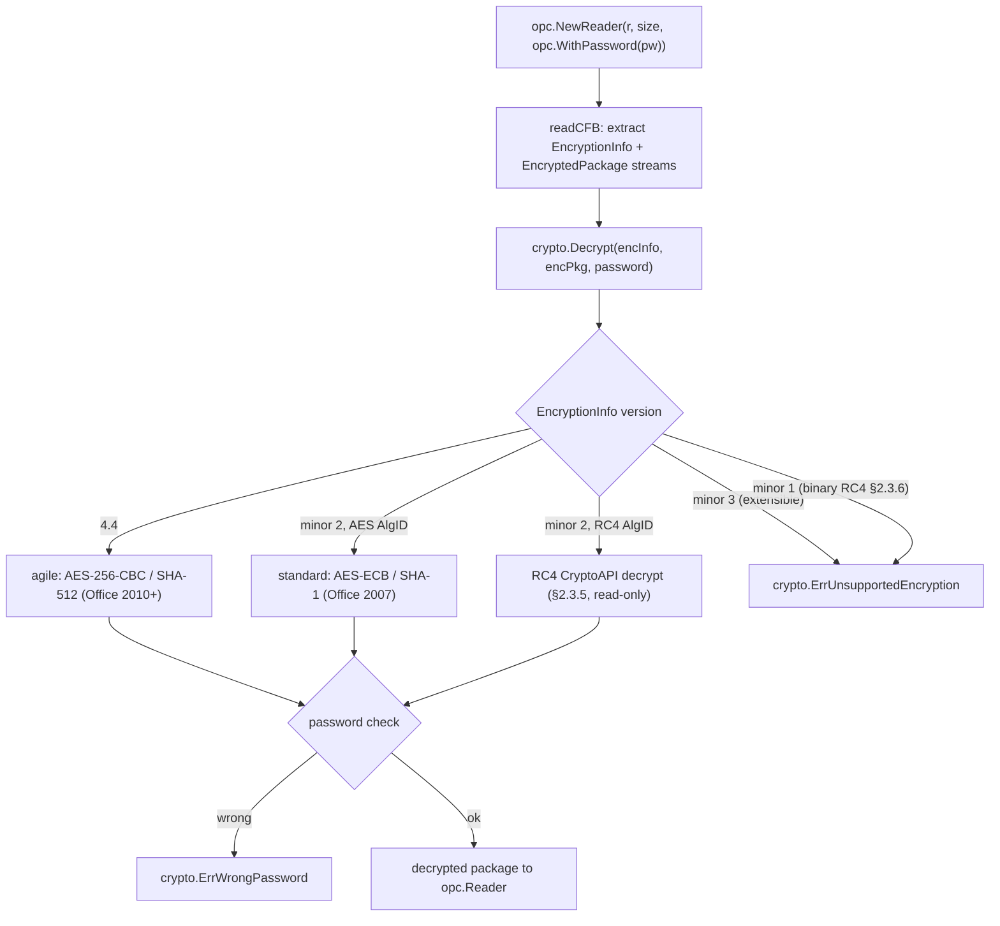

# Encryption and signing

This guide covers spine's security surface: reading and writing password-encrypted
Office documents, signing and verifying OPC package signatures, and the trust
model for VBA macro projects. All of it is built on Go's standard-library crypto
(plus a RC4 implementation from the public spec, which the stdlib omits).

The crypto primitives live in `github.com/mgilbir/spine/common/crypto`; its
error sentinels are the ones you match with `errors.Is`:

- `crypto.ErrWrongPassword` — the supplied password did not decrypt the package.
- `crypto.ErrUnsupportedEncryption` — an encryption scheme spine cannot decode
  (e.g. the version-1.1 binary-format RC4 scheme, §2.3.6).

The package-level `opc.ErrEncrypted` is returned by an open that meets an
encrypted input and was given no password; retry the same call with
`opc.WithPassword`.

## Password encryption

Read and write documents protected with Office's real AES encryption — both the
modern "agile" scheme ([MS-OFFCRYPTO], AES-256/CBC with SHA-512, the Office
2010+ default) and the older ECMA-376 "standard" scheme (AES-ECB with SHA-1,
Office 2007), not the legacy 16-bit obfuscation. An encrypted document opens
through the ordinary open — `opc.WithPassword` decrypts the CFB-wrapped package
into a normal reader, auto-detecting the scheme;
`opc.SaveEncrypted(w, packageBytes, password)` writes an agile
container with a fresh random salt, and `opc.SaveEncryptedWithOptions` selects
the scheme (agile or standard), AES key size, and whether to emit the optional
`\x06DataSpaces` metadata streams some Office builds expect.

Whether a file is encrypted is a property of the file, not a choice the caller
makes, so there is no separate encrypted entry point: every open detects the CFB
container from the input's leading bytes and decrypts it when a password is
available.

```go
doc, err := docx.Open("secret.docx", opc.WithPassword("hunter2"))
wb, err := xlsx.OpenReader(r, size, opc.WithPassword("hunter2"))
pkg, err := opc.NewReader(r, size, opc.WithPassword("hunter2")) // raw *opc.Reader
```

| Format | Open by path | Open in memory | Save by path | Save in memory |
| --- | --- | --- | --- | --- |
| docx | `docx.Open` | `docx.OpenReader` | `Document.SaveEncrypted` | `Document.SaveEncryptedTo` |
| xlsx | `xlsx.Open` | `xlsx.OpenReader` | `Workbook.SaveEncrypted` | `Workbook.SaveEncryptedTo` |
| pptx | `pptx.Open` | `pptx.OpenReader` | `Presentation.SaveEncrypted` | `Presentation.SaveEncryptedTo` |

Encryption is format-generic — the same CFB wrapper carries any OOXML zip — so
these are one mechanism with three spellings, not three implementations. The
opens take `opc.ReaderOption`s, which is also how the decompression bounds and
`opc.WithAllowMissingDataIntegrity` (see [Integrity](#integrity)) reach an
encrypted open.

The password is held out of reach of `fmt` and `encoding/json`: it lives in an
unexported pointer field of `opc.ReaderOptions`, so no `%+v` of a configuration
value — at any nesting depth — can print it, and no error message names it.

An open that meets an encrypted input with no password returns
`opc.ErrEncrypted`; a wrong password returns `crypto.ErrWrongPassword` (from
`github.com/mgilbir/spine/common/crypto`). The open can additionally
**decrypt** the obsolete legacy RC4 CryptoAPI scheme ([MS-OFFCRYPTO] §2.3.5) —
the RC4 stream cipher is implemented from its public specification (Go's standard
library omits RC4), validated against the RFC 6229 vectors, and cross-validated
against `msoffcrypto-tool`'s independent RC4 implementation; because RC4 is
cryptographically broken, saving it is deliberately not offered, and the
version-1.1 binary-format RC4 scheme (§2.3.6) — which never wraps an OOXML
package — is still rejected with `crypto.ErrUnsupportedEncryption`. Built on
Go's standard-library crypto only, and cross-validated against `msoffcrypto-tool`.

### Integrity

Only the agile scheme authenticates its ciphertext: an HMAC over the
`EncryptedPackage` stream, keyed from the document key and stored in the
descriptor's `dataIntegrity` element. A package opened from a standard or RC4
container is unauthenticated by construction — the password was right, but
nothing proves the bytes are the ones the author encrypted.

An agile package whose HMAC fails, or whose descriptor carries no
`dataIntegrity` block at all, is rejected with
`crypto.ErrIntegrityCheckFailed`. Absence is not treated as "nothing to check":
the descriptor is plaintext and covered by no MAC, so an attacker who can modify
the file can delete that element as easily as they can flip bits in the
malleable CBC ciphertext.

Office always emits `dataIntegrity`. For a third-party producer that does not,
opt out explicitly — never inferred from the file:

```go
wb, err := xlsx.OpenReader(r, size,
    opc.WithPassword(password), opc.WithAllowMissingDataIntegrity(true))
```

The opt-in accepts only a *missing* block. It never relaxes a failed HMAC and
never accepts a half-present block (one of the two attributes missing), which no
honest producer writes. `crypto.DecryptWithOptions` reports which scheme
produced the bytes and whether they were authenticated
(`DecryptResult.Scheme`, `DecryptResult.IntegrityVerified`).

### How the open decides

An open reads the input's leading bytes. A zip is read as a package; a CFB
container is decrypted first — the open pulls out its `EncryptionInfo` and
`EncryptedPackage` streams and hands them to `crypto.Decrypt`, which dispatches
on the `EncryptionInfo` version. With no password the same detection is what
produces `opc.ErrEncrypted` instead of an opaque zip error. The recovered
plaintext is read as a package directly, so a container nested inside a
container is a corrupt file rather than a second layer to decrypt.



The agile and standard schemes both encrypt and decrypt; RC4 CryptoAPI is
decrypt-only. The extensible scheme (version minor 3) and the obsolete
version-1.1 binary-format RC4 (§2.3.6, which never wraps an OOXML package) are
identified and rejected with `crypto.ErrUnsupportedEncryption` rather than
decoded.

## Digital signatures

Sign and verify OPC package signatures (XML-DSig, ECMA-376 Part 2 §13) with
Go-stdlib crypto only — `Reader.VerifySignatures()` recomputes part digests and
checks the `SignatureValue` against the embedded X.509 certificate;
`opc.SignPackage` writes SHA-256 RSA/ECDSA signatures and includes Microsoft
Office's application-specific signature object (`SignatureInfoV1`) so Office's
signature UI recognizes them (see `common/xml` for the inclusive Canonical XML
1.0 implementation).

`SignatureInfo.CoveredParts` reports what a signature actually protects, and
follows the whole trust chain to say so: `SignatureValue` covers `SignedInfo`, a
`SignedInfo` reference covers an `<Object>`, and only the manifest of a covered
`<Object>` contributes parts. Anyone can append an `<Object>` with a manifest of
correct digests to a signed package without the private key; such an Object is
reported through `Problems` and makes the signature invalid, never as coverage.
Verification also accepts the SHA-1 algorithms older Office signatures use, so
`Valid` alone does not imply a modern algorithm — reject
`info.UsesWeakAlgorithms()` (see `WeakAlgorithms`, `DigestMethods`) if your
policy requires SHA-256.

## VBA macros

Extract, inject/replace, and remove the `vbaProject.bin` project on
`Document`/`Workbook`/`Presentation` (`HasMacros`, `VBAProject`, `SetVBAProject`,
`RemoveVBAProject`). Injecting flips the package to its macro-enabled flavor
(`.docm`/`.xlsm`/`.pptm`) and removal flips it back. The project is carried as an
opaque binary blob — spine never parses or executes it, and an injected project
brings its source's macros and their trust, so only inject bytes you trust.
