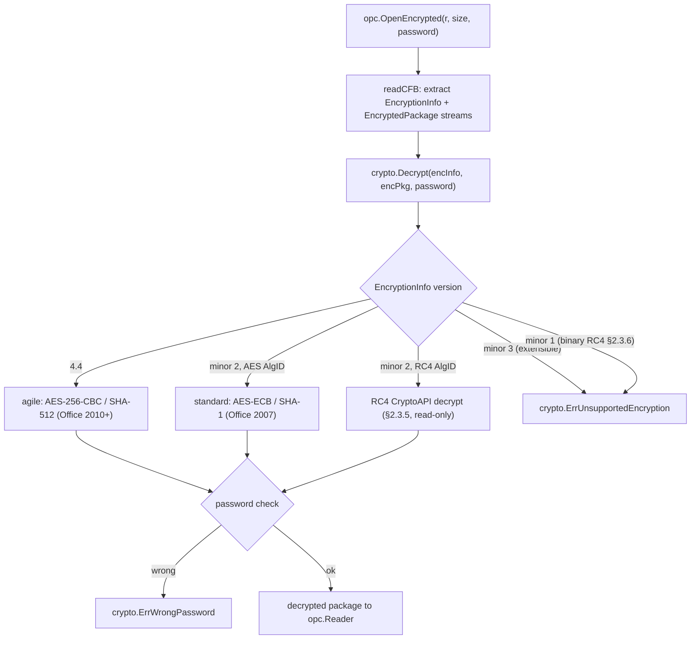

# Encryption and signing

This guide covers spine's security surface: reading and writing password-encrypted
Office documents, signing and verifying OPC package signatures, and the trust
model for VBA macro projects. All of it is built on Go's standard-library crypto
(plus a RC4 implementation from the public spec, which the stdlib omits).

The crypto primitives live in `github.com/mgilbir/spine/common/crypto`; its
error sentinels are the ones you match with `errors.Is`:

- `crypto.ErrWrongPassword` — the supplied password did not decrypt the package.
- `crypto.ErrUnsupportedEncryption` — an encryption scheme spine cannot decode
  (e.g. the version-1.1 binary-format RC4 scheme, §2.3.6).

The package-level `opc.ErrEncrypted` is returned by the plain open path when it
meets an encrypted input; open such a file with `opc.OpenEncrypted` (or a
format's `OpenEncrypted` wrapper) and a password instead.

## Password encryption

Read and write documents protected with Office's real AES encryption — both the
modern "agile" scheme ([MS-OFFCRYPTO], AES-256/CBC with SHA-512, the Office
2010+ default) and the older ECMA-376 "standard" scheme (AES-ECB with SHA-1,
Office 2007), not the legacy 16-bit obfuscation. `opc.OpenEncrypted(r, size,
password)` decrypts a CFB-wrapped package into a normal reader, auto-detecting
the scheme; `opc.SaveEncrypted(w, packageBytes, password)` writes an agile
container with a fresh random salt, and `opc.SaveEncryptedWithOptions` selects
the scheme (agile or standard), AES key size, and whether to emit the optional
`\x06DataSpaces` metadata streams some Office builds expect. `docx.OpenEncrypted`
/ `Document.SaveEncrypted` wrap it for Word by file path, with
`docx.OpenEncryptedReader` / `Document.SaveEncryptedTo` as the in-memory
reader/writer pair. The plain open path detects an encrypted input and returns
`opc.ErrEncrypted`; a wrong password returns `crypto.ErrWrongPassword` (from
`github.com/mgilbir/spine/common/crypto`). `OpenEncrypted` can additionally
**decrypt** the obsolete legacy RC4 CryptoAPI scheme ([MS-OFFCRYPTO] §2.3.5) —
the RC4 stream cipher is implemented from its public specification (Go's standard
library omits RC4), validated against the RFC 6229 vectors, and cross-validated
against `msoffcrypto-tool`'s independent RC4 implementation; because RC4 is
cryptographically broken, saving it is deliberately not offered, and the
version-1.1 binary-format RC4 scheme (§2.3.6) — which never wraps an OOXML
package — is still rejected with `crypto.ErrUnsupportedEncryption`. Built on
Go's standard-library crypto only, and cross-validated against `msoffcrypto-tool`.

### How OpenEncrypted decides

`opc.OpenEncrypted` reads the CFB container, pulls out its `EncryptionInfo` and
`EncryptedPackage` streams, and hands them to `crypto.Decrypt`, which dispatches
on the `EncryptionInfo` version. The plain open path does the opposite: it
detects the CFB magic and returns `opc.ErrEncrypted` to steer you here.

The agile and standard schemes both encrypt and decrypt; RC4 CryptoAPI is
decrypt-only. The extensible scheme (version minor 3) and the obsolete
version-1.1 binary-format RC4 (§2.3.6, which never wraps an OOXML package) are
identified and rejected with `crypto.ErrUnsupportedEncryption` rather than
decoded.

## Digital signatures

Sign and verify OPC package signatures (XML-DSig, ECMA-376 Part 2 §13) with
Go-stdlib crypto only — `Reader.VerifySignatures()` recomputes part digests and
checks the `SignatureValue` against the embedded X.509 certificate;
`opc.SignPackage` writes SHA-256 RSA/ECDSA signatures and includes Microsoft
Office's application-specific signature object (`SignatureInfoV1`) so Office's
signature UI recognizes them (see `common/xml` for the inclusive Canonical XML
1.0 implementation).

## VBA macros

Extract, inject/replace, and remove the `vbaProject.bin` project on
`Document`/`Workbook`/`Presentation` (`HasMacros`, `VBAProject`, `SetVBAProject`,
`RemoveVBAProject`). Injecting flips the package to its macro-enabled flavor
(`.docm`/`.xlsm`/`.pptm`) and removal flips it back. The project is carried as an
opaque binary blob — spine never parses or executes it, and an injected project
brings its source's macros and their trust, so only inject bytes you trust.
